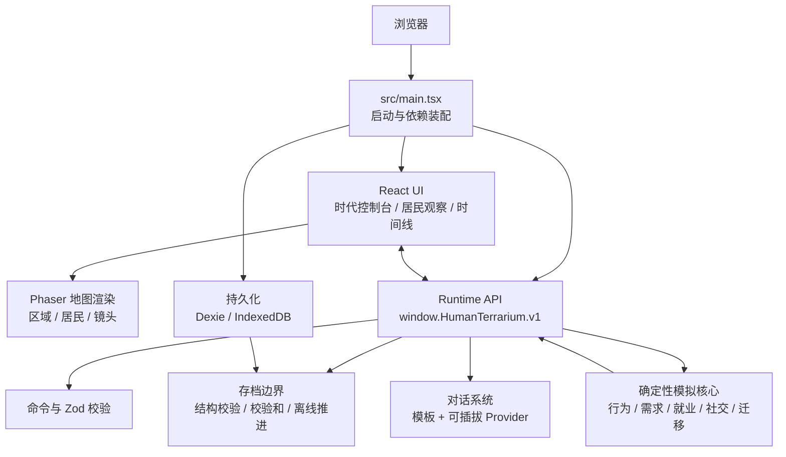

# 人间一隅 · Human Terrarium

一个可以放在屏幕一角观察的“人类生态箱”：居民在城市社区中生活、工作、休息、社交，并持续受到经济、制度、技术、文化与环境的影响。

项目目前处于 **0.1 原型阶段**，已经具备可运行的模拟核心、时代控制台、居民观察界面、本地存档和浏览器 SDK。

## 核心体验

- **观察一个持续运转的社区**：24 位初始居民会在 4 个区域之间移动，并根据时间和需求选择活动。
- **认识具体的人**：每位居民都有年龄、职责、性格、特质、需求、关系、记忆、收入和就业状态。
- **改变他们所处的时代**：经济景气、工资、物价、住房、福利、医疗、自动化、污染等参数会传导到居民生活。
- **投放政策与机遇**：政策可以修正时代参数，机遇可以面向全体、某类职责或某个区域。
- **追踪因果变化**：时间线保留最近 240 条事件，并用 `causalId` 关联操作与结果。
- **离线继续演进**：关闭页面后再次进入，世界会按离线时间推进，最多补算 7 天。

## 当前内容

### 社区区域

| 区域 | 用途 |
| --- | --- |
| 栖居里 | 住宅、厨房与安静的小巷 |
| 新业街 | 办公室、商店、餐馆与诊所 |
| 榕荫园 | 公园、广场与社区活动空间 |
| 城事边廊 | 仓储、维修、能源与社区入口 |

### 居民职责

居民职责分为生产供应、商业服务、医疗照护、维修建设、公共安全和行政文化。职责会影响工作地点，也会影响自动化冲击下的岗位风险。

### 时代预设

| 预设 | 特征 |
| --- | --- |
| 平稳当代社区 | 就业和公共服务相对稳定 |
| 经济下行期 | 景气、工资与信任下降，失业和住房压力上升 |
| 产业升级期 | 生产力与工资提高，同时出现岗位转换压力 |
| 高自动化架空城 | 自动化和社会保障都较高，工作意义发生变化 |

切换预设只会替换时代条件，不会重建居民、清空时间或删除历史。

## 快速开始

### 环境要求

- Node.js `20.19+` 或 `22.12+`
- npm
- 现代桌面浏览器

### 安装与启动

```bash
git clone https://github.com/llkkjjse/human-terrarium.git
cd human-terrarium
npm install
npm run dev
```

打开终端显示的地址，通常是 [http://localhost:5173](http://localhost:5173)。

### 生产构建

```bash
npm run build
```

构建产物会生成到 `dist/`。

### 测试

```bash
# 单元测试、组件测试和回归测试
npm test

# 监听模式
npm run test:watch

# Playwright 真实浏览器测试
npm run test:e2e
```

端到端测试当前使用 Microsoft Edge，视口为 `1440 × 900`。

## 如何游玩

1. 在左侧“时代控制台”选择时代预设，或拖动参数形成自定义时代。
2. 启用租住支持、投放培训机遇，观察居民收入、储蓄、就业与需求变化。
3. 使用顶部的暂停、1×、2×、4× 控制时间。
4. 在右侧选择居民，查看他的职责、性格、需求与近期记忆。
5. 在地图和观察时间线之间对照，追踪时代变化如何落到具体的人身上。

## 系统架构



架构的核心原则是：**模拟逻辑保持纯 TypeScript 和确定性，渲染、界面、持久化与外部 API 通过明确边界接入。**

### 分层职责

| 层 | 位置 | 职责 |
| --- | --- | --- |
| 启动层 | `src/main.tsx` | 恢复存档、创建 Runtime、挂载 React、安排自动保存 |
| UI 层 | `src/ui/` | 时代控制台、居民列表、档案、时间线和状态提示 |
| 地图层 | `src/game/` | Phaser 场景、区域与居民精灵、选择和镜头交互 |
| API 层 | `src/api/runtime.ts` | 世界快照、命令、订阅、对话、推进、导入导出 |
| 模拟层 | `src/sim/` | 世界模型、随机数、时代场景、居民行为、事件和对话 |
| 持久化层 | `src/persistence/` | IndexedDB、主备份轮换、校验、离线补算和安全启动 |

### 世界状态

`WorldState` 是系统的单一事实来源，主要包含：

```text
WorldState
├─ scenario       时代参数、政策与机遇
├─ districts      地图区域及其几何信息
├─ residents      居民、性格、需求、关系与记忆
├─ metrics        活力、健康、信任、流动、平等与安全
├─ events         最近 240 条可观察事件
├─ rngState       可复现的伪随机状态
└─ time           tick、日期、分钟与速度
```

相同的种子、初始世界和命令序列会产生相同的模拟结果。渲染层不负责决定居民行为，只负责展示世界快照。

### 数据流

#### 命令流

```text
用户或 SDK
  → runtime.dispatch(command)
  → Zod 校验命令
  → applyCommand 修改世界
  → 生成带 causalId 的事件
  → 通知事件订阅者和状态订阅者
  → React / Phaser 更新显示
```

#### 时间推进

```text
runtime.advance(ticks)
  → stepWorld
  → 选择活动与目标区域
  → 更新需求、收入、储蓄、健康和就业
  → 处理机遇、社交、社区指标与迁移
  → 发布事件与新世界快照
```

单次 `advance` 最多推进 32 个时间片；一个时间片代表游戏内 15 分钟。

#### 存档流

```text
WorldState
  → 写入保存时间
  → 完整结构校验与校验和
  → IndexedDB primary
  → 下次保存前，合法 primary 轮换为 backup
```

启动时优先读取主存档；主存档损坏时尝试备份。若已有存档无法恢复，游戏会进入临时世界并暂停自动保存，避免覆盖原始数据。

## 浏览器 SDK

页面启动后会暴露版本化入口：

```js
const api = window.HumanTerrarium.v1;
```

### 查询世界

```js
const world = api.getWorldSnapshot();
const caregivers = api.listResidents({ role: 'care', alive: true });
const resident = api.getResident('resident-01');
const scenario = api.getScenario();
```

所有查询结果都是深拷贝，修改返回对象不会直接改变正在运行的世界。

### 修改时代

```js
await api.dispatch({
  type: 'update-era-parameter',
  path: 'economy.prosperity',
  value: 35,
});

await api.dispatch({
  type: 'apply-scenario-preset',
  presetId: 'industrial-upgrade',
});

await api.dispatch({
  type: 'create-opportunity',
  opportunity: {
    name: '社区技能培训',
    target: 'everyone',
    durationTicks: 96,
    prosperityBoost: 12,
  },
});
```

所有写入命令都会经过 Zod 校验，并返回：

```ts
type CommandResult =
  | { ok: true; causalId?: string }
  | { ok: false; code: 'INVALID_COMMAND' | 'NOT_FOUND'; message: string };
```

### 订阅变化

```js
const unsubscribeEvents = api.subscribe('*', (event) => {
  console.log(event.type, event.title, event.causalId);
});

const unsubscribeState = api.subscribeState((world) => {
  console.log(world.day, world.minuteOfDay);
});

// 不再需要时解除订阅
unsubscribeEvents();
unsubscribeState();
```

### 对话 Provider

可以为显式调用 `createDialogue` 注册外部对话生成器。Provider 收到的是隔离副本，失败或超时会回退到本地模板。

```js
const unregister = api.registerDialogueProvider(async (request) => ({
  text: `${request.speaker.name}：今天社区里有些新变化。`,
  tone: 'warm',
}));

const line = await api.createDialogue('resident-01', 'resident-02');
console.log(line);

unregister();
```

当前自动社交事件仍使用本地模板，不会自动请求已注册的外部 Provider。

### 导入与导出

```js
const save = await api.exportSave();
const json = JSON.stringify(save);

const result = await api.importSave(json);
if (!result.ok) console.error(result.message);
```

## 存档与离线演算

- 使用 Dexie 写入浏览器 IndexedDB。
- 默认每 30 秒自动保存，并在 `pagehide` 时补充保存。
- 存档包含版本号、保存时间、校验和和完整世界快照。
- 只会把验证通过的主存档轮换为备份。
- 载入时对区域、居民、指标、事件和时代配置进行完整校验。
- 离线时间每 15 分钟换算为一个时间片，最多补算 `672` 个时间片，即 7 天。

存档目前只存在当前浏览器中，没有账号系统、云同步或多人共享。

## 项目结构

```text
human-terrarium/
├─ src/
│  ├─ api/             浏览器 Runtime SDK
│  ├─ game/            Phaser 地图场景与地图模型
│  ├─ persistence/     IndexedDB、存档验证和启动恢复
│  ├─ sim/             纯 TypeScript 模拟领域
│  ├─ ui/              React 界面组件
│  ├─ main.tsx         应用入口
│  └─ styles.css       全局视觉样式
├─ tests/
│  ├─ api/             Runtime 与导入导出测试
│  ├─ e2e/             Playwright 浏览器测试
│  ├─ game/            地图模型测试
│  ├─ persistence/     存档与数据库测试
│  ├─ review/          关键回归测试
│  ├─ sim/             模拟与生态行为测试
│  └─ ui/              React 组件测试
├─ docs/               设计与实现计划
├─ package.json
└─ vite.config.ts
```

## 技术栈

- **TypeScript**：领域模型和公共契约
- **React 19**：控制台与观察界面
- **Phaser 3**：地图和居民渲染
- **Zod 4**：命令、场景和存档边界校验
- **Dexie 4**：IndexedDB 持久化
- **Vite 7**：开发服务器与生产构建
- **Vitest + Testing Library**：单元与组件测试
- **Playwright**：真实浏览器验收

## 开发约定

- 模拟核心不得依赖 React、Phaser 或浏览器 DOM。
- 新的外部写操作应通过 `WorldCommand` 与 `runtime.dispatch` 进入。
- 向外暴露的世界、居民和事件应返回副本，避免外部代码污染模拟状态。
- 新存档字段必须同步更新 `WorldState`、存档校验和相关回归测试。
- 影响居民生活的时代参数应落实到居民数据，而不只是社区汇总指标。

## 已知限制

- 自动发生的居民对话尚未接入外部 AI Provider。
- `focus-resident` 命令目前仅保留接口和目标校验。
- 页面主要针对桌面宽屏设计，窄屏和高倍率缩放仍需优化。
- 当前没有服务端、多人模式、云存档和跨设备同步。
- 存档格式为 `schemaVersion: 1`，尚未提供跨版本迁移器。

## 路线图

- 更丰富的职责链、家庭关系和长期人生阶段
- 让政策产生延迟、分群和副作用，而不是只做即时数值修正
- 将可插拔对话 Provider 接入自主交流，并增加频率与成本控制
- 补充移动端和窄屏布局
- 增加存档管理界面、手动导入导出和版本迁移
- 添加更多地图区域、建筑互动和可视化因果追踪

## 仓库

[https://github.com/llkkjjse/human-terrarium](https://github.com/llkkjjse/human-terrarium)
